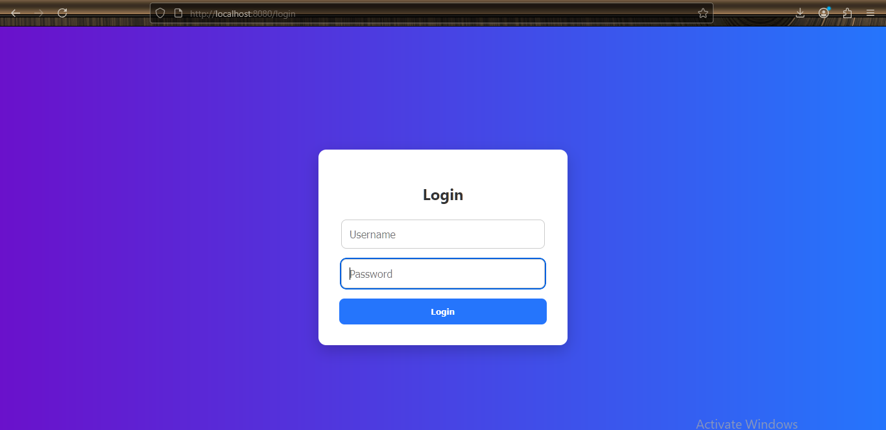
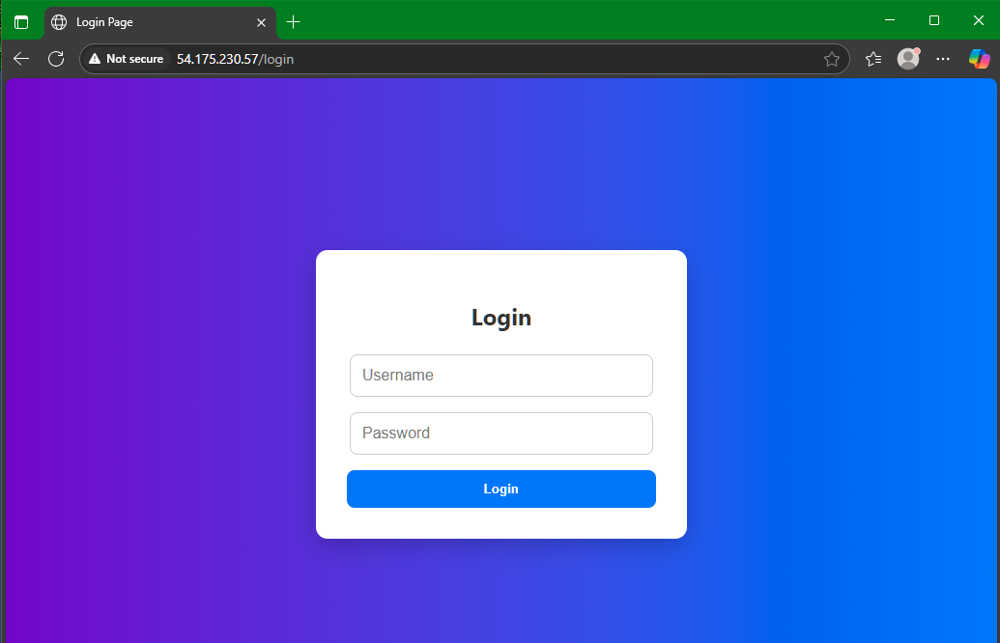

---

# 🔐 Flask Login App (Dockerized)

This is a simple Flask web application that includes basic user **login** functionality. It's fully containerized with Docker, making it easy to run locally or deploy to the cloud (e.g., AWS EC2 using Terraform).

---

## 🌟 Features

* 📝 User login and dummy authentication
* 🐳 Dockerized (build once, run anywhere)
* ☁️ Ready for cloud deployment (e.g., AWS EC2 via Terraform)

---

## 🏗️ Folder Structure

```
flask-login-app/
├── app.py
├── requirements.txt
├── Dockerfile
└── templates/
    └── login.html
```

---

## 🚀 Getting Started

### 📋 Prerequisites

* Python 3.8+
* Docker
* (Optional) Terraform + AWS Account (for cloud deployment)

---

### 🧪 Run Locally (Without Docker)

```bash
# Clone the repo
git clone https://github.com/BorgOwen/cloudlegends_task.git
cd cloudlegends_task

# Create a virtual environment and activate it
python -m venv venv
source venv/bin/activate  # On Windows: venv\Scripts\activate

# Install dependencies
pip install -r requirements.txt

# Run the Flask app
python app.py
```

Then visit: `http://localhost:5000` in your browser.

---

### 🐳 Run with Docker

```bash
# Build the Docker image
docker build -t flask-login-app .

# Run the Docker container
docker run -d -p 8080:5000 flask-login-app
```

Visit: `http://localhost:8080`

---

## 🌍 Deploy to AWS EC2 with Terraform

> You can deploy this app to the cloud using [Terraform](https://www.terraform.io/). The EC2 user data script will:
>
> * Install Docker
> * Pull your Docker image from DockerHub
> * Run it on port 5000 mapped to 8080

Make sure your Terraform EC2 security group allows inbound traffic on port 8080.

---

## 📦 DockerHub Image

You can pull the pre-built image directly from DockerHub:

```bash
docker pull borgx/flask-login-app
```

---

## 🖼️ Screenshots





---

## 📄 License

This project is licensed under the **MIT License**. You are free to use, modify, and distribute it as you like.

---